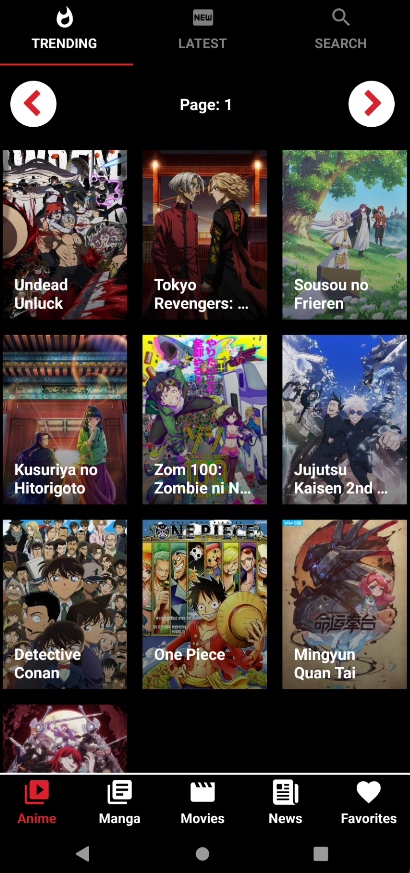
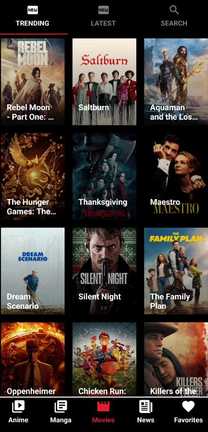
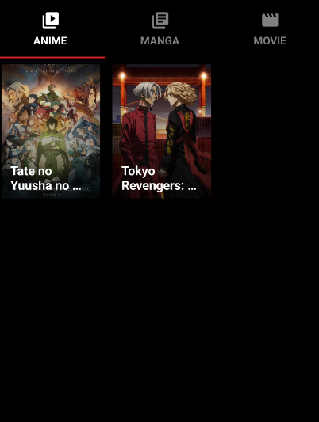
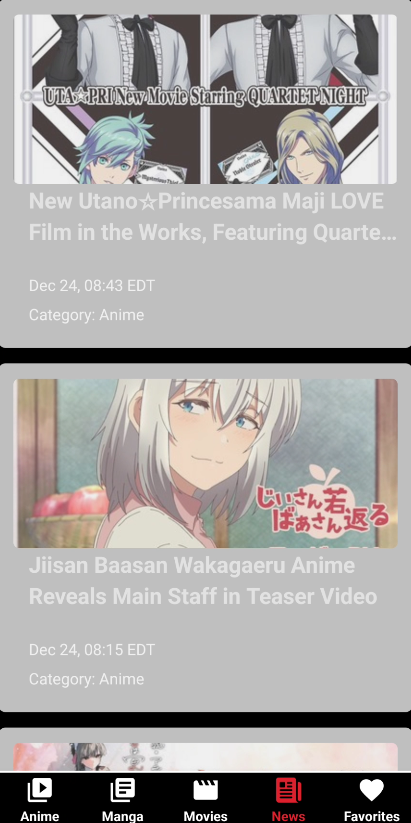

# AnimePalooza

A multi-category entertainment Android app for streaming anime, manga, dramas, news, and more!

## Features

- **Anime Section**
  - Discover top airing anime.
  - Explore anime details, episodes, and recommendations.
  - Stream anime episodes seamlessly.

- **Manga Section**
  - Find the latest manga chapters.
  - Read manga details and recommendations.
  - Stream manga chapters effortlessly.

- **Dramacool (Movies Section)**
  - Access a vast collection of Asian dramas and movies.
  - Get information, watch streaming links, and explore recommendations.

- **FlixHQ (Movies Section)**
  - Stream global entertainment content.
  - Explore trending, latest, and search for content.

- **News Section**
  - Stay updated with the latest news articles.

<h2>Screenshots</h2>

  

    <h3>Anime Section</h3>
    
  

  

    <h3>Manga Section</h3>
    
  

  

    <h3>Movies Section</h3>
    
  

  

    <h3>Favorites Section</h3>
    
  

  

    <h3>News Section</h3>
    
  

  
  

  <h3>DEMO</h3>

## Technologies Used

- React Native
- React Navigation
- Axios
- Expo
- Consumed API

## Download the App

You can download the latest version of our app from the following link:

[Download App APK](https://animepalooza.netlify.app/)

### Installation Instructions:

1. Download the APK file to your Android device.
2. Open the downloaded APK to start the installation process.
3. If prompted, enable "Install from Unknown Sources" in your device settings.
4. Follow the on-screen instructions to complete the installation.
5. Open the app and enjoy!

**Note:** Make sure to download the APK only from the provided link to ensure you have the latest and official version of the app.
